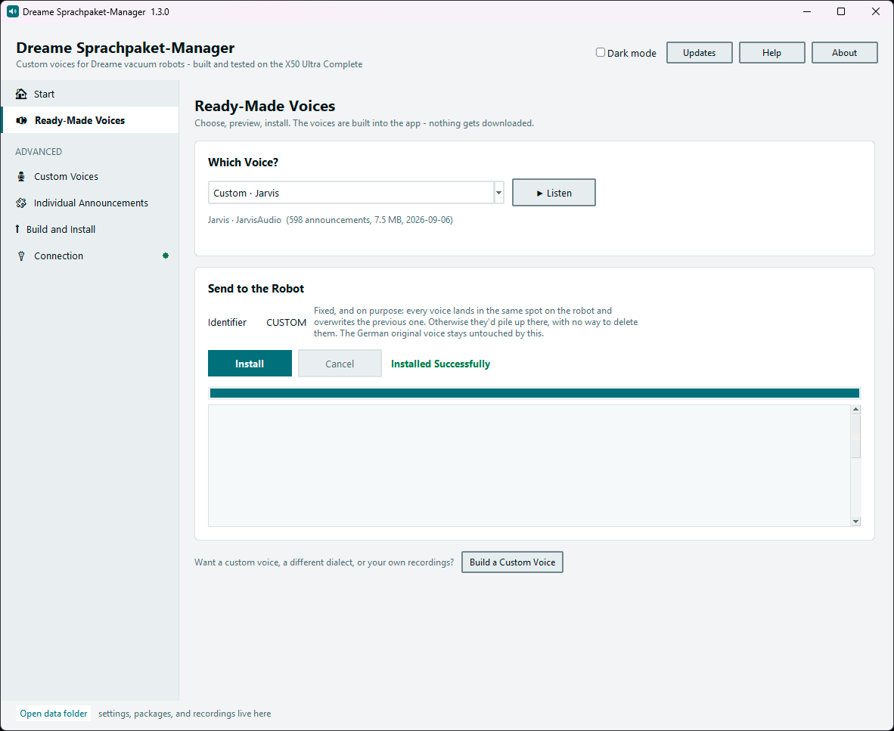

# Dreame Voice Pack Manager

Give your vacuum robot a different voice: Bavarian, Hessian, Viennese,
or Berlin dialect. Windows app for **Dreame, MOVA, and Trouver** robots.
No rooting, no installation, a single file.

```
    "So, packma's. I fang zum Saugn o."                  Bavarian
    "Ei gude, dann geht's los. Isch fang aa zu sauge."   Hessian
    "Na servas, dann fang ma au. I saug jetzt."          Viennese
    "Na denn los. Ick fang an zu saugen."                Berlin dialect
```

> [!WARNING]
> **This is a bilingual fork.** The original German project is by
> Maximilian Mangold: [Anon365-Project/dreame-sprachpaket-manager]
> (https://github.com/Anon365-Project/dreame-sprachpaket-manager). This
> fork adds a language switch - **English or Deutsch**, picked from a
> dropdown next to *Dark mode* and applied on the next launch - covering
> everything you see and interact with in the app: buttons, labels,
> error messages, the dialect pack names. That covers roughly 99% of the
> app; the supporting guides linked below (under `docs/`) are still
> German-only text for now, regardless of which language the app itself
> is set to. The functionality, the dialect voice packs themselves
> (their actual spoken content stays in dialect, on purpose), and the
> license are unchanged from upstream.

**This fork doesn't currently ship a prebuilt EXE** - only the
translated source. Run it directly:

```bash
git clone https://github.com/Elanoran/dreame-sprachpaket-manager
cd dreame-sprachpaket-manager
pip install requests
python main.py
```

1. Under **Start**, choose the matching app (Dreamehome, MOVA Home, or
   Trouver) and sign in with the same credentials. The app then fetches
   your robot's voice pack by itself.
2. Under **Ready-Made Voices**, pick one, *Listen*, *Install*.

Want the original single-file EXE experience? Build it yourself - see
[Development](docs/Entwicklung.md) - or grab upstream's own prebuilt
EXE (German UI) from
[Anon365-Project/dreame-sprachpaket-manager](https://github.com/Anon365-Project/dreame-sprachpaket-manager/releases/latest).

Either way: the voices are built into the program - nothing gets
downloaded at install time. Don't like it? *Restore Original Voice*.

**Does this work with my robot?** If you can pick a language under *Voice*
in the Dreamehome app, it works. 402 models checked - [how I verified
this](docs/Modelle.md).

> Private hobby project, MIT license, **no warranty and no liability**.
> Not reviewed or supported by Dreame, MOVA, or Trouver.
> [What that means exactly](#disclaimer)



---

## What the app can do

**Five ready-made voices** are built in and instantly usable: Bavarian
(male and female), Hessian, Viennese, and Berlin dialect. They speak
genuine dialect, including in pronunciation - not just word choice.

Beyond that, if you want: write and speak **your own text**, import
**your own recordings**, swap **individual announcements**. Three more
dialects - Swabian, Saxon, and Kölsch - are ready as text and can be
voiced right in the app. All of that lives under *Advanced* and only
shows up if you go looking for it. See [Custom Voices and
Dialects](docs/Eigene-Stimmen.md).

Want a starting point for your own text pack? [examples/jarvis-voice](examples/jarvis-voice)
has a full 593-line script written as a dry, formal AI-butler
character - plus notes on voicing it with a voice you're actually
entitled to use.

**Preview first:** before anything goes to the robot, *Listen* plays
four typical announcements. Don't like the voice? Nothing happened.

**The volume is right:** every announcement is brought to exactly the
level of the original announcement it replaces - measured, not guessed.

---

## Will this damage my robot?

Five sentences; the long version is under [Safety](docs/Sicherheit.md).

* **No firmware** is touched and nothing is rooted. The app uses exactly
  the voice-pack feature the manufacturer already provides - it's the
  same process as switching languages in the Dreamehome app.
* Your pack is built as a **copy of the official pack** for your model.
  Announcements you don't replace stay unchanged.
* The **robot checks it itself** against checksum and size. If anything
  doesn't match, it discards the pack and keeps its current voice.
* Before sending anything, the app asks whether your device even knows
  the voice-pack service. If it doesn't answer there, **nothing gets
  written at all**.
* **The way back is one click**: the robot loads the original voice
  straight from Dreame.

Installs always go under the identifier `CUSTOM` - that's fixed, on
purpose. The robot creates its own folder per identifier, and there's no
way to delete those via the cloud. A single identifier just overwrites
itself and permanently uses only one slot.

---

## Frequently asked questions

**Windows warns about the file.** Expected: it isn't signed, and a
certificate costs a few hundred euros a year. *More info → Run anyway*.
If you don't like that, you can build it yourself in two minutes
([Development](docs/Entwicklung.md)).

**My pack doesn't show up in the Dreamehome app.** That's normal, not a
bug - the app only lists Dreame's own languages.
[More on this](docs/Problemloesung.md)

**The robot doesn't pick up the pack.** Usually the Windows Firewall or
separate networks. [What to do](docs/Problemloesung.md)

**The robot sounds quieter after switching.** That's due to its firmware,
not the recordings - it sometimes only re-applies its volume after a
restart. Turn it off and on once.

**How do I get genuine dialect in the pronunciation?** The built-in
voices already have it. Voicing your own text needs ElevenLabs for that;
the Windows text-to-speech voice is free and offline, but only carries
the dialect in word choice. [More on this](docs/Eigene-Stimmen.md)

**"ffmpeg wasn't found."** Only matters for mp3, wav, or m4a input -
ready-made .ogg files (Vorbis, mono, 16000 Hz) work without it. Easiest
fix: under **Individual Announcements**, click *Set Up ffmpeg
Automatically* - it downloads the official Windows build from
BtbN/FFmpeg-Builds on GitHub (the source ffmpeg.org itself links) and
places it in the app's data folder, nothing else on the system is
touched. Alternatively, just copy an existing `ffmpeg.exe` next to the
app.

---

## Privacy

* Email and password go exclusively to Dreame's servers.
* **Password and ElevenLabs key live in the Windows Credential
  Manager** - not in a file, not in the EXE, never in plain text on
  disk. Only if the Credential Manager isn't available does the app
  fall back to `config.json`, encrypted there with Windows DPAPI (tied
  to your Windows account).
* All files live in the `Daten` folder next to the app. To remove
  everything, just delete that folder.
* The app doesn't send any usage data.

This is checked on every self-test: the app, its intermediate builds,
and the entire version history are searched for the password and the
ElevenLabs key. Not a single hit.

### Sharing the app

The data folder holds no secrets, but it does hold personal information:
your email address, name, your robot's device ID and MAC address, this
PC's IP, the last-used ElevenLabs voice, and the log.

Under *Connection*, **Remove Personal Data** clears exactly that -
including the entries in the Credential Manager. Your built voice packs
and the dialect texts are kept; there's nothing personal in those.

If you're only sharing the EXE, there's nothing to do anyway: the
`config.json` lives in the data folder.

---

---

## License

**Source code: MIT license** - see [LICENSE](LICENSE). You may use,
modify, and redistribute the app, including in your own projects,
commercially or privately. The only condition: the copyright notice and
license text stay intact. That also applies to the **dialect texts** -
they're part of the source code.

**Audio files: separate terms** - see
[LICENSE-AUDIO.md](LICENSE-AUDIO.md). The recordings in the releases
were generated with ElevenLabs; a license as broad as MIT can't be
granted for those. Use privately and redistribute unchanged: yes. Use as
training material for speech models or sell as a standalone product: no.

---

## Disclaimer

**This is a private hobby project. There is no warranty, no assurance,
and no liability - for anything.**

* The software is provided "as is", with no guarantee of function,
  fitness, or freedom from defects. That's not boilerplate - it's the
  explicit content of the MIT license you receive it under.
* **Use is at your own responsibility and own risk.** No liability is
  assumed for damage to the robot, base station, data, or other
  property - to the extent legally permitted.
* This project has **no affiliation with Dreame, MOVA, Trouver, or
  Xiaomi**. It is neither supported, reviewed, nor approved by these
  manufacturers. All trademarks and product names belong to their
  respective owners.
* A custom voice pack is **not intended use** in the manufacturer's
  sense. Whether this affects warranty or guarantee claims is for the
  manufacturer alone to decide. When in doubt, check beforehand.
* The app exclusively uses the voice-pack feature the manufacturer
  itself provides, doesn't touch firmware, and can be reverted at any
  time (*Restore Original Voice*). That significantly lowers the risk -
  it's still not a guarantee.

If you don't agree with this, please don't use the app.

---

---

## A tip?

Many evenings and weekends went into this app: taking apart the Dreame
cloud protocol, figuring out why swapped announcements stayed silent (it
was the number mapping), measuring why custom recordings sounded quieter
than the originals, and writing 593 announcements in seven dialects.
None of it had to happen - it was just fun.

**The app is and stays free.** It's here with all its source code; you
may use, modify, and redistribute it.

If it's worth something to you and you enjoyed your robot speaking in
dialect, a tip is welcome (this refers to the original German project's
author, not this fork):

### ☕ [paypal.me/anon365project](https://paypal.me/anon365project)

The same link is in the app under *About*.

And to be clear: a tip is a **gift**, not payment for a product. There's
no service in return, no claim to support, and no preferential
treatment. Give nothing, and you get exactly the same software - and
are just as welcome. A tip changes nothing about the disclaimer below.

Just as helpful and completely free: report a bug, send an improvement
for the dialect texts, or show the app to someone with a Dreame.

---

---

## Further reading

The same pages are also in the app under **Help** → *Read the full
guides*. These guide pages are still in German (not yet translated in
this fork).

| | |
|---|---|
| [Which robots work](docs/Modelle.md) | verified models, announcement mapping |
| [Safety](docs/Sicherheit.md) | why this doesn't damage the robot |
| [Custom voices and dialects](docs/Eigene-Stimmen.md) | your own text, recordings, Windows text-to-speech |
| [If something doesn't work](docs/Problemloesung.md) | Dreamehome app, network, firewall |
| [Technical background](docs/Technik.md) | cloud instead of token, audio format, loudness |
| [Development](docs/Entwicklung.md) | source code structure, building the EXE yourself |
| [Changelog](CHANGELOG.md) | what changed per version |
| [Publishing](VEROEFFENTLICHEN.md) | steps for a new release |

---
